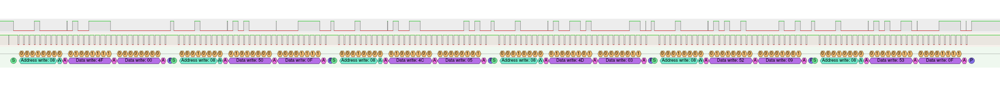

# [WIP] Arduino Portenta H7 Bootloader Reverse Engineering Project

## Boot process (non-exhaustive)

1. MCU boots the CM7 core from `0x08000000`
2. The PMIC is configured
3. USB DFU is configured
3. Update vector table to point to user provided handlers.
4. Jump to `0x08040000` (user code)

## I²C Devices

| Address (7bit) | Device                                                       |
| -------------- | ------------------------------------------------------------ |
| 0x08           | [NXP PF1550 PMIC](datasheets/PF1550.pdf)                     |
| 0x36           | [Maxim MAX17262](datasheets/MAX17262.pdf)                    |
| 0x3f           | ANX7625*                                                     |
| 0x48           | [NXP SE050C2**](datasheets/SE050.pdf) ([docs](https://www.nxp.com/products/security-and-authentication/authentication/edgelock-se050-plug-trust-secure-element-family-enhanced-iot-security-with-maximum-flexibility:SE050?tab=Documentation_Tab)) |
| 0x60           | [Microchip ATECC608A**](datasheets/ATECC608A.pdf) ([docs](https://www.microchip.com/en-us/product/ATECC608A#document-table)) ([lib](https://github.com/MicrochipTech/cryptoauthlib)) |

\* No datasheet available to the general public.

\** Only a summary "datasheet". 

## Boot I²C data

| Packet | Address (7bit) | R/W | Data | Description |
| ------ | -------------- | --- | ---- | ----------- |
| 1      | 0x08           | W   | 0x4f, 0x00 | LDO2_VOLT: 1.80V |
| 2      | 0x08           | W   | 0x50, 0x0f | LDO2_CTRL: VLDO2_EN = 1, VLDO2_STBY_EN = 1, VLDO2_OMODE = 1, VLDO2_LPWR = 1 |
| 3      | 0x08           | W   | 0x4c, 0x05 | LDO1_VOLT: 1.00V |
| 4      | 0x08           | W   | 0x4d, 0x03 | LDO1_CTRL: VLDO1_EN = 1, VLDO1_STBY_EN = 1 |
| 5      | 0x08           | W   | 0x52, 0x09 | LDO3_VOLT: 1.20V |
| 6      | 0x08           | W   | 0x53, 0x0f | LDO3_CTRL: VLDO3_EN = 1, VLDO3_STBY_EN = 1, VLDO3_OMODE = 1, VLDO3_LPWR = 1 |
| 7      | 0x08           | W   | 0x9C, 0x80 | See [#5](https://github.com/olback/h7-bootloader-rev/issues/5) |
| 8      | 0x08           | W   | 0x9E, 0x20 | See [#5](https://github.com/olback/h7-bootloader-rev/issues/5) |
| 9      | 0x08           | W   | 0x42, 0x02 | SW3_CTRL1: SW3_ILIM = 1.5A |
| 10     | 0x08           | W   | 0x94, 0xA0 | VBUS Current limit = 1500mA |
| 11     | 0x08           | W   | 0x3B, 0x0F | SW2_CTRL: SW2_EN = 1, SW2_STBY_EN = 1, SW2_OMODE = 1, SW2_LPWR = 1 |
| 12     | 0x08           | W   | 0x35, 0x0F | SW1_CTRL: SW1_EN = 1, SW1_STBY_EN = 1, SW1_OMODE = 1, SW1_LPWR = 1 |
| 13     | 0x08           | W   | 0x42, 0x01 | This write is not part of the bootloader itself but it's sent just before your Arduino code runs. [fixup3V1Rail](https://github.com/arduino/ArduinoCore-mbed/blob/8d5510ad677ff84dcfbc0fe9626c9d1cb4329763/variants/PORTENTA_H7_M7/variant.cpp#L230) |

## Oscillators

The 25MHz and 27MHz oscillators have to be manually enabled by setting the PH1 pin to high.
